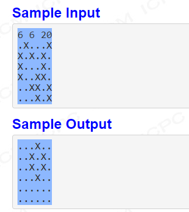

# Game-of-life

# 1081: Game of Life:
To tackle this problem, I’ve decided that I will use multiple functions in this case 4 each des
out different objectives.
1. **populateArray** – setup array based on user input and convert it to int.
2. **nextTick** – acts like a next game iteration, used to simulate the life using the given rules
3. **countNeighbours** – counts how many alive cells are there around the cell.
4. **printMatrix**– prints easily modifiable output, to print different steps

## The solution is as follows
● First populate the array with user input\
● (in a while loop) next tick (next generation decider based on rules) uses count Neighbours\
● Print Matrix
## populateArray
The first idea behind this function was to make it Boolean based as to save memory and sp
since C doesn’t come by default with Boolean like in Java or Python I was forced to use int
instead the function takes the input and creates an array of 0’s 1’s with int property where
dead cells and 1 represents alive.
## nextTick
This function is responsible for simulation of the life, it does that by using countNieghbours
determining what should happen based on the rules provided below.\
-Any live cell with fewer than two live neighbours die, as if caused by an under population.\
-Any live cell with two or three live neighbours lives on to the next generation.\
-Any live cell with more than three live neighbours dies, as if by overpopulation.\
-Any dead cell with exactly three live neighbours becomes a live cell, as if by reproduction

## countNeighbours
Count the neighbours around cell (x,y) ie. if cell (0,1) is given it will be the first column and 2 rows.
Which means there are only 6 possible checks to doas the program is designed to not go over the
boundaries given by the user at the start. -Any live cell with fewer than two live neighbours die, as if
caused by an under population.
## printMatrix
Prints the output the given step, as it’s run at the end only the end result is printed but this is a very
useful debugging function as it can be used to demonstrate how the program behaves as it goes through
steps. This function uses 2 for loops to iterate over columns and rows for the end result.
